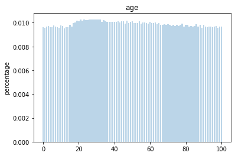
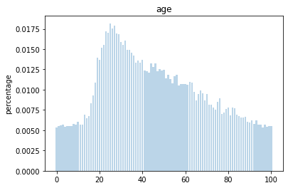
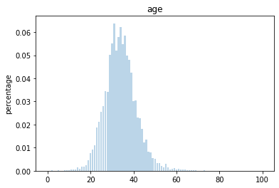

## Age and Gender via Transfer Learning - (on IMDB/ Wiki Dataset) 
This model is using classification approach. Trained on 22k images scrapped from wikipedia. IMDB dataset is also attached and can be used similarly.


## Motivation
General age prediction models uses regression based approach, that is sometimes not so accurate. Using the classification approach to find the age by not only using the max argument as we do. Instead, Taking consideration all the prediction values to predict apparent age of the person.

Similar to age prediction - gender prediction was done by creating binary layer.


## Build status
The model architecture is ready to be used for development and deployment weights are released.

The original work consumed face pictures collected from IMDB (7 GB) and Wikipedia (1 GB). You can find these data sets [here](https://data.vision.ee.ethz.ch/cvl/rrothe/imdb-wiki/). In this post, I will just consume wiki data source to develop solution fast. You should download faces only files.


## Code style

[](https://github.com/feross/standard)
 
## Screenshots
Include logo/demo screenshot etc.


## Classification Separation between classes (age 1 to 100)
---
### After 5 epoch

### After 100 epoch

### After 250 epoch


## Tech/framework used
<b>Built with</b>
- Tensorflow 2.3.1
- Keras
- Numpy

## Features
Results are very satisfactory even though it does not have a good perspective. Marlon Brando was 48 and Al Pacino was 32 in Godfather Part I.

## Code Example
Researchers develop an age prediction approach and convert classification task to regression. They propose that you should multiply each softmax out with its label.

This is done faster using Numpy.

```python
# Multiclass prediction
predictions = age_model.predict(test_x)
 
# Multiplying the weights of each prediction to class and summing it up
output_indexes = np.array([i for i in range(0, 101)])
actual_predictions = np.sum(predictions * output_indexes, axis = 1)
```
Show what the library does as concisely as possible, developers should be able to figure out **how** your project solves their problem by looking at the code example. Make sure the API you are showing off is obvious, and that your code is short and concise.

## Installation
Provide step by step series of examples and explanations about how to get a development env running.

## Tests
Describe and show how to run the tests with code examples.

## How to use?
- Download dataset and clean it - using `data_loading_cleaning.ipynb` notebook
- Train the model which you are willing to use
- Evaluation script of the same model is there to infer your models

## Contribute
You can for the repository - create a pull requrest after making changes or can drop the issue byt creating a new issue. It would be helpful for the community.


## Credits
Sefik's Blog Post inspired me to build this project

https://sefiks.com/2019/02/13/apparent-age-and-gender-prediction-in-keras/

## Dataset Reference

@InProceedings{Rothe-ICCVW-2015,
  author = {Rasmus Rothe and Radu Timofte and Luc Van Gool},
  title = {DEX: Deep EXpectation of apparent age from a single image},
  booktitle = {IEEE International Conference on Computer Vision Workshops (ICCVW)},
  year = {2015},
  month = {December},
}

